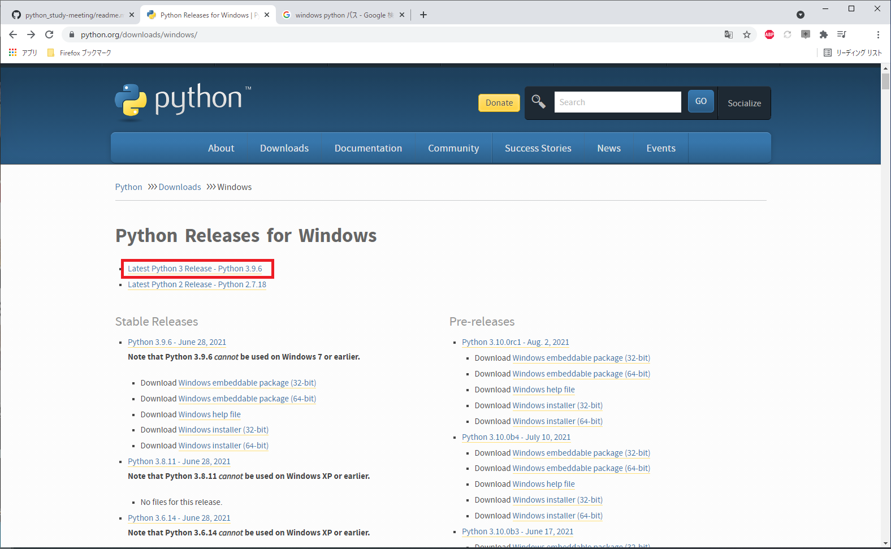
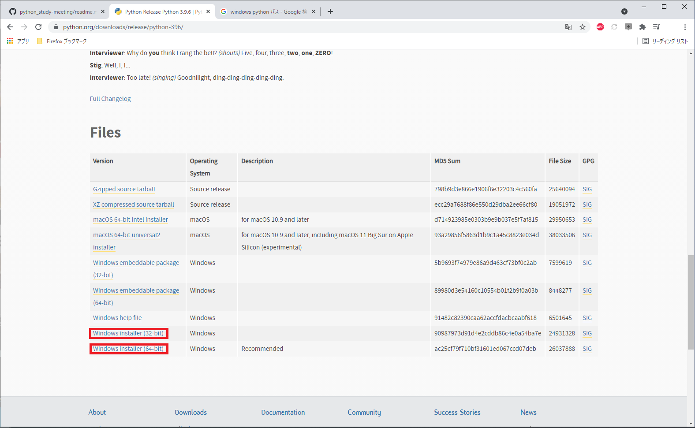

# python環境セットアップ
## ※この資料はWindowsで使用することを前提に記載してます。

### 1. 環境確認
   自分のOSが「32bit」「64bit」のどちらであるかを確認する。
### 2. pythonのダウンロード
   2-1. python.orgにアクセス  
   2-2. 「Downloads」→「Windows」をクリック

    2-3. 「Latest Python 3 Release - Python 3.X.X」をクリック

    2-4. 自分の環境に合わせて「Windows installer (32-bit)」「Windows installer (64-bit)」をクリックしてインストーラをダウンロード

### 3. Pythonのインストール
   [2. pythonのダウンロード](#2-pythonのダウンロード)でダウンロードしたインストーラを実行
### 4. Path疎通・確認
### 5. 動作確認
### 6. VSCodeのインストール
### 7. pylint flake8の設定
