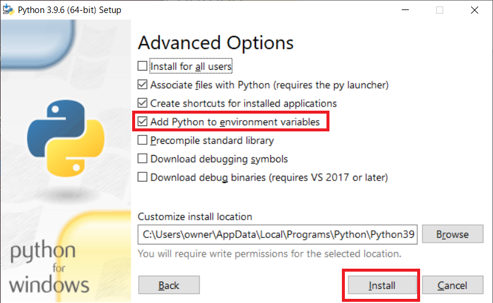
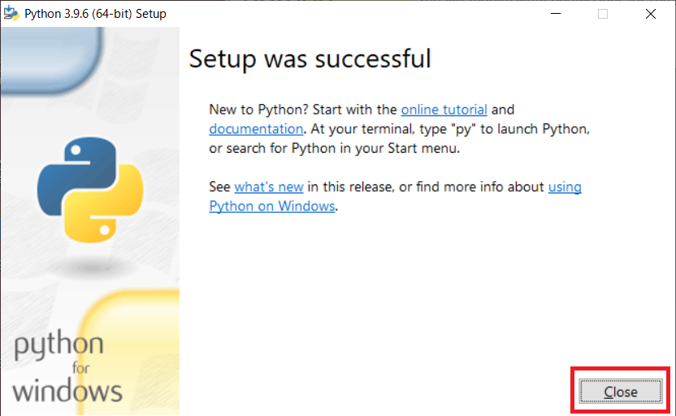

# python環境セットアップ
## ※この資料はWindowsで使用することを前提に記載してます。

### 1. 環境確認
   自分のOSが「32bit」「64bit」のどちらであるかを確認する。
### 2. pythonのダウンロード
   2-1. [python.org]([https://www.python.org/)にアクセス  
   2-2. 「Downloads」→「Windows」をクリック  
  
    2-3. 「Latest Python 3 Release - Python 3.X.X」をクリック  
  
    2-4. 自分の環境に合わせて「Windows installer (32-bit)」「Windows installer (64-bit)」をクリックしてインストーラをダウンロード

### 3. Pythonのインストール
   3-1. [2. pythonのダウンロード](#2-pythonのダウンロード)でダウンロードしたインストーラを実行  
   3-2. 「Add Python 3.9 to PATH」にチェックをつけて「Customize installation」を押下  
  
   3-3. 「Next」を押下
  
   3-4. 「Add Python to environment variables」にチェックをつけて「Next」を押下  
  
   3-5. インストールが完了したら「Close」を押下  
  
### 4. Path疎通・確認
   4-1. コマンドプロンプト や PowerShellで「echo $PATH」と入力してEnterを押下、Pythonのインストールしたディレクトリが表示されることを確認
### 5. 動作確認
   5-1. コマンドプロンプト や PowerShellで「python --version」と入力してEnterを押下、インストールしたPythonのバージョンが表示されることを確認
### 6. VSCodeのインストール
   6-1. [https://code.visualstudio.com/](https://code.visualstudio.com/)にアクセス  
   6-2. 「Download for Windows」をクリックしてインストーラをダウンロード  
  
   6-3. ダウンロードしたインストーラを実行
### 7. pylint flake8の設定
   7-1. コマンドプロンプト や PowerShellで「pip flake8」と入力してEnterを押下
